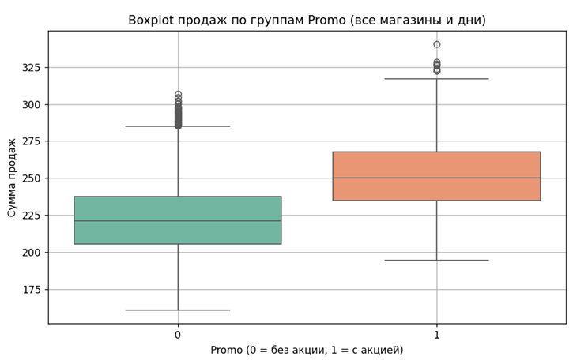
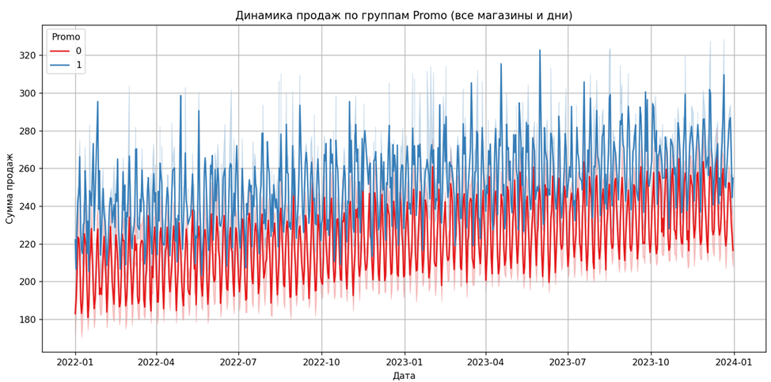

# 🧪 A/B-тест: Влияние промо-акций на продажи в магазинах

Аналитический проект для портфолио стажёра-аналитика.  
Проверяем, влияют ли промо-акции на продажи, используя квази-A/B анализ и визуализации.

[](ProjectABshop_FULL_Final.ipynb)

---

## 📌 Цель

Определить, повышают ли промо-акции (`Promo = 1`) ежедневные продажи магазинов.  
Анализ основан на симулированных данных из Kaggle.

---

## 🗃️ Данные

- Источник: [Store Sales Dataset](https://www.kaggle.com/datasets/abhishekjaiswal4896/store-sales-dataset)
- 7300 записей за 2 года
- 10 магазинов
- Поля: `Date`, `Store_ID`, `Sales`, `Promo`, `Holiday`

---

## 🔬 Методология

- Тип: **Квази-A/B тест** (нет рандомизации)
- Тест: **Welch t-test** (корректен при неравных группах)
- Группы: `Promo = 1` и `Promo = 0`
- Визуализация: `boxplot`, `histplot`, `time series`

---

## 🧪 Результаты

| Сценарий                       | Разница средних | p-value     |
|-------------------------------|------------------|-------------|
| Все магазины, все дни         | +29.5            | ~0          |
| Store_ID = 1, без праздников  | +27.95           | < 1e-37     |

---

## 📈 Примеры визуализации

### Распределение продаж:


### Динамика продаж:


---

## 📁 Структура репозитория

```text
ProjectABshop.ipynb   # 📓 Основной Jupyter Notebook
store_sales.csv                  # 📂 Датасет
ProjectABshop.docx               # 📝 Презентационный отчёт
README.md                        # 📘 Этот файл
